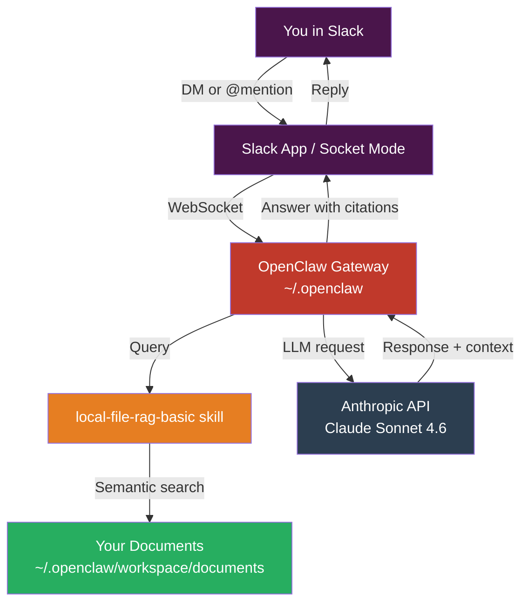
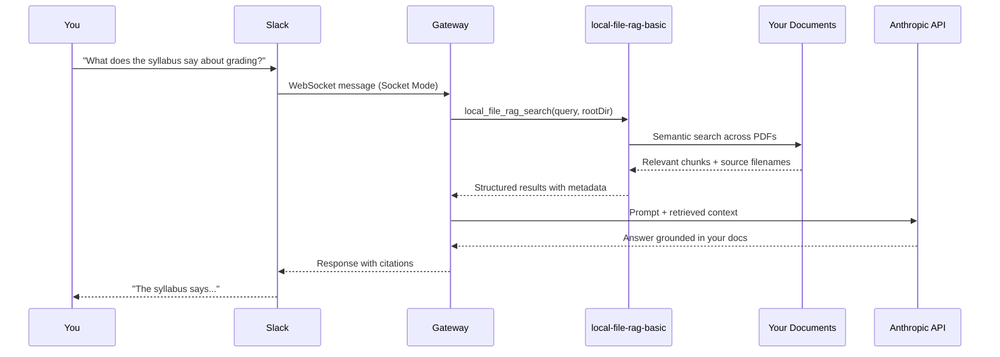

# OpenClaw + Slack + Local RAG Setup
> Personal AI assistant running locally on Mac, connected to Slack, with RAG over your own documents.

## What We Built

A self-hosted AI assistant (OpenClaw) that:
- Runs locally on your Mac
- Is accessible via Slack DMs and channels
- Answers questions using **only your personal documents** via RAG (Retrieval-Augmented Generation)
- Uses Claude (Anthropic API) as the underlying model

---

## Architecture Overview



---

## Setup Flow

```mermaid
flowchart TD
    S([Start]) --> N1[Install Node.js 24\nnvm install 24]
    N1 --> N2[Install OpenClaw CLI\ncurl openclaw.ai/install | bash]
    N2 --> N3[Run onboarding\nopenclaw onboard --mode local]
    N3 --> N4[Enter Anthropic API Key\nconsole.anthropic.com]
    N4 --> N5[Start Gateway\nopenclaw gateway]

    N5 --> SL1[Create Slack App\napi.slack.com/apps]
    SL1 --> SL2[Enable Socket Mode]
    SL2 --> SL3[Generate Bot Token xoxb-...\nand App Token xapp-...]
    SL3 --> SL4[Configure tokens in OpenClaw\nopenclaw config set channels.slack.*]
    SL4 --> SL5[Restart Gateway\nSlack channel started ✓]

    SL5 --> R1[Install RAG skill\nclawhub install local-file-rag-basic]
    R1 --> R2[Create documents folder\n~/.openclaw/workspace/documents]
    R2 --> R3[Copy your PDFs in]
    R3 --> R4[Restart Gateway]
    R4 --> R5([Ask questions in Slack ✓])

    style S fill:#2c3e50,color:#fff
    style R5 fill:#27ae60,color:#fff
```

---

## Troubleshooting We Hit (and Fixed)

```mermaid
flowchart TD
    E1[auth store lock busy] -->|pkill -f openclaw\nrm ~/.openclaw/.auth.lock| F1[Retried onboard ✓]
    E2[openclaw.json\nNo such file] -->|Created manually\nwith ai + gateway keys| F2[Gateway started ✓]
    E3[gateway.mode missing] -->|Added gateway.mode: local\nto openclaw.json| F3[Validation passed ✓]
    E4[Invalid config\nroot: Invalid input] -->|openclaw doctor --fix\nrevealed Node.js too old| F4[Upgraded to Node 24 ✓]
    E5[node:sqlite missing] -->|nvm install 24\nnvm use 24| F5[SQLite available ✓]
    E6[EADDRINUSE port 18789] -->|openclaw gateway stop| F6[Single instance running ✓]
    E7[Wrong skills installed\nChinese / Windows paths] -->|clawhub uninstall\nclawhub install local-file-rag-basic| F7[Correct RAG skill ✓]
    E8[Low Anthropic credits] -->|Added credits at\nconsole.anthropic.com/billing| F8[API requests working ✓]

    style E1 fill:#c0392b,color:#fff
    style E2 fill:#c0392b,color:#fff
    style E3 fill:#c0392b,color:#fff
    style E4 fill:#c0392b,color:#fff
    style E5 fill:#c0392b,color:#fff
    style E6 fill:#c0392b,color:#fff
    style E7 fill:#c0392b,color:#fff
    style E8 fill:#c0392b,color:#fff
    style F1 fill:#27ae60,color:#fff
    style F2 fill:#27ae60,color:#fff
    style F3 fill:#27ae60,color:#fff
    style F4 fill:#27ae60,color:#fff
    style F5 fill:#27ae60,color:#fff
    style F6 fill:#27ae60,color:#fff
    style F7 fill:#27ae60,color:#fff
    style F8 fill:#27ae60,color:#fff
```



---

## RAG Query Flow



---

## Key File Locations

| Path | Purpose |
|------|---------|
| `~/.openclaw/openclaw.json` | Main config (API key, gateway mode, Slack tokens) |
| `~/.openclaw/workspace/skills/` | Installed ClawHub skills |
| `~/.openclaw/workspace/documents/` | Your documents for RAG |
| `~/.openclaw/logs/` | Gateway logs and config audit trail |
| `~/Library/LaunchAgents/com.openclaw.gateway.plist` | macOS daemon (installed by --install-daemon) |

---

## Your Documents Loaded

| File | Pages | Content |
|------|-------|---------|
| `altyrex-designer-help-combined.pdf` | 2,487 | Full Alteryx Designer help reference |
| `Simplyx - Data Analysis with Alteryx.pdf` | 51 | CU Boulder courseware for Core Cert prep |
| `Introduction.pdf` | 2 | Simplyx quick-start and grading guide |
| `Syllabus Business Analytics 2026.pdf` | 5 | BAIM 4120 syllabus, Spring 2026, CU Boulder |

---

## Adding More Documents

Just drop files into the documents folder — no re-indexing needed:

```bash
cp /path/to/new/file.pdf ~/.openclaw/workspace/documents/
```

Supported formats: PDF, DOCX, Markdown, plain text, CSV, JSON (under 20MB each).

---

## Example Queries in Slack

```
"What tools does Alteryx have for data blending?"
"What are the grading criteria in the Business Analytics syllabus?"
"How does Simplyx help prepare for the Core Certification?"
"Search my documents for information about predictive analytics"
```

---

## Stack

| Component | Details |
|-----------|---------|
| **OpenClaw** | v2026.6.6 (8c802aa) |
| **Node.js** | v24 (required for node:sqlite) |
| **Model** | claude-sonnet-4-6 via Anthropic API |
| **Slack transport** | Socket Mode (no public URL needed) |
| **RAG skill** | local-file-rag-basic by @wjreliable |
| **OS** | macOS (Apple Silicon) |
