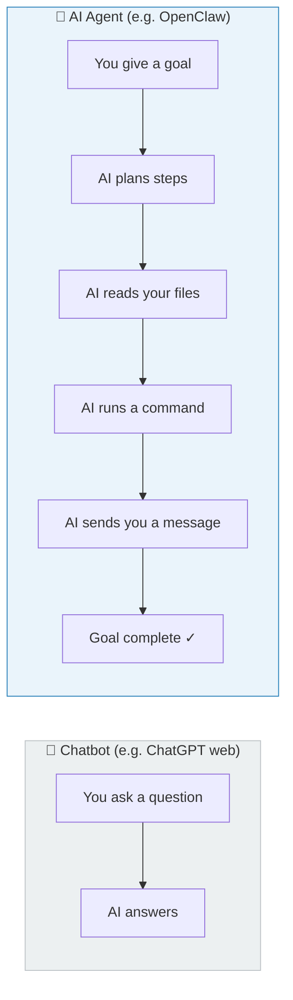
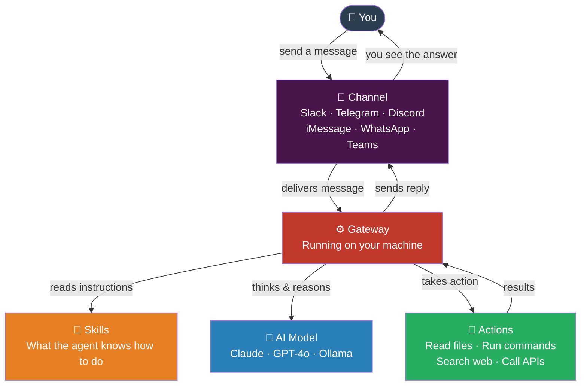
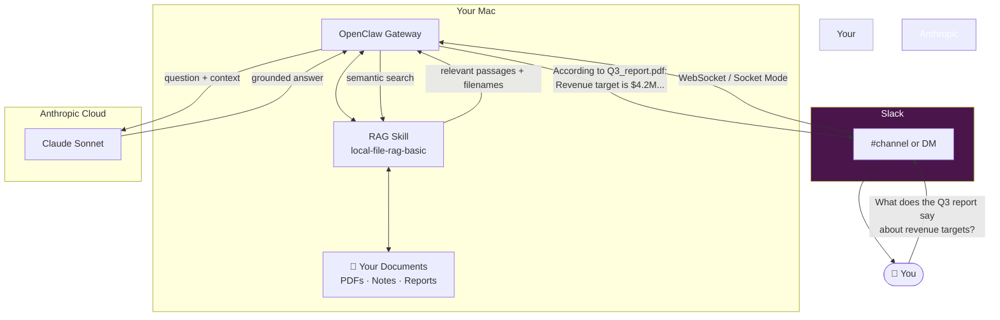
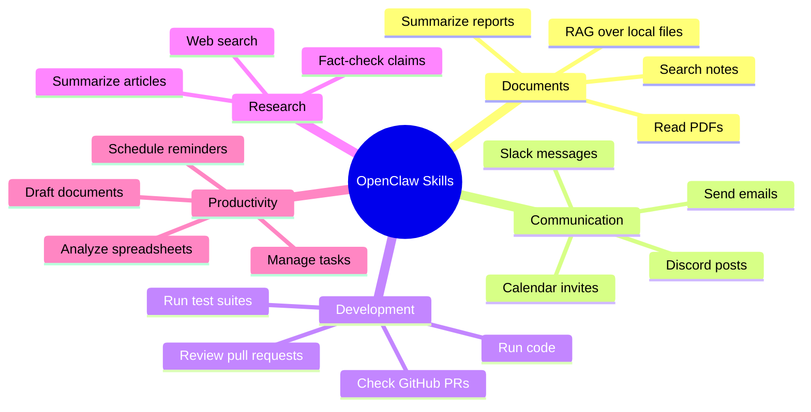
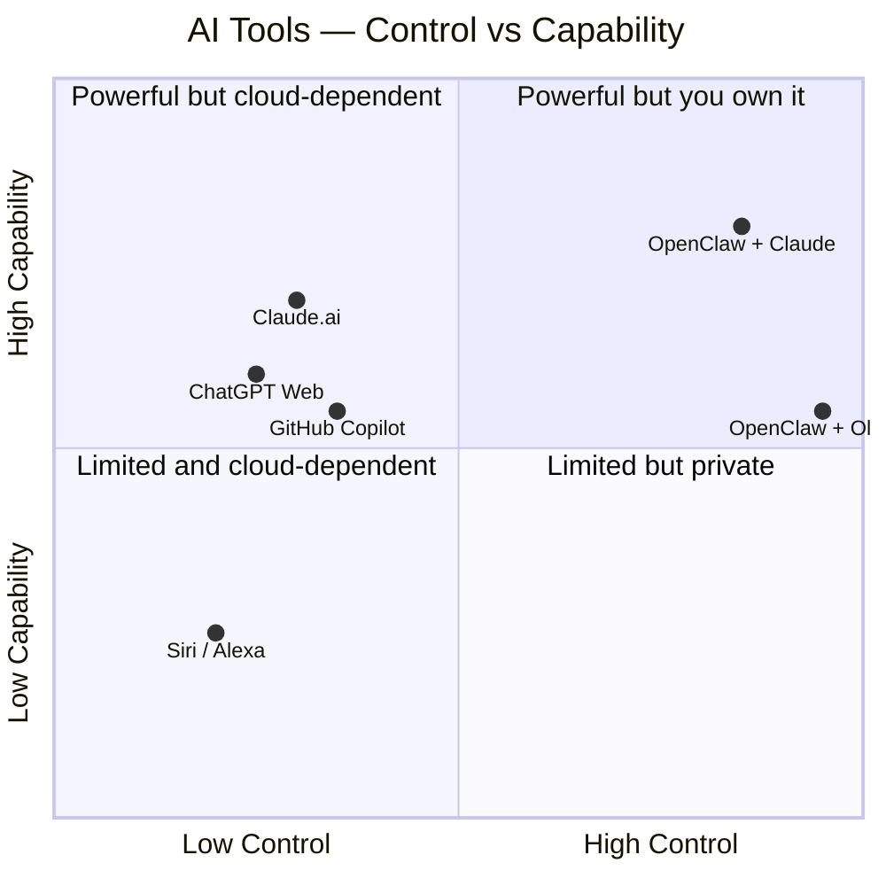
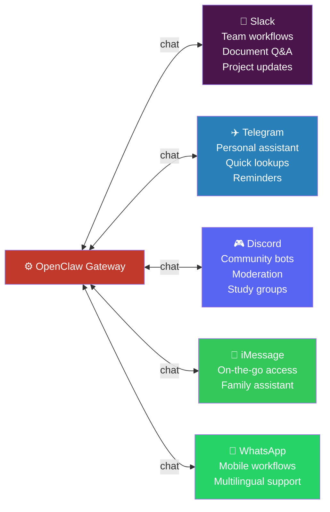
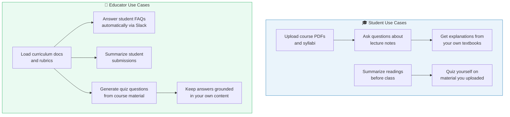
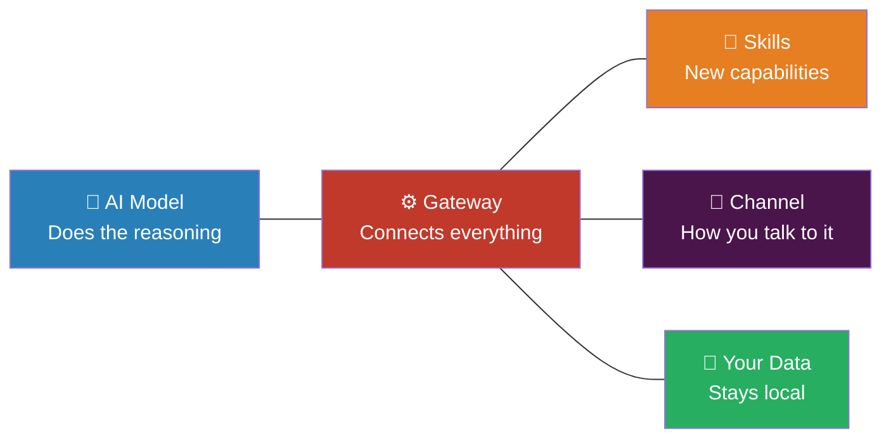
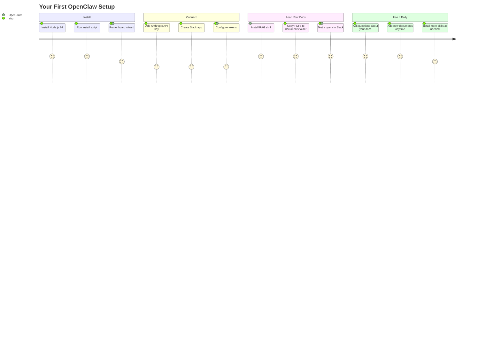

# Introduction to OpenClaw
### A Beginner's Guide to Your First Agentic AI Assistant

---

## What Is an AI Agent?

You've probably used AI tools that answer questions — you type something, it responds. That's a chatbot. An **AI agent** is different. It doesn't just respond; it *acts*. It can read your files, run commands, search the web, send messages, and chain multiple steps together to complete a goal — all on its own.

Think of the difference this way:



OpenClaw is an open-source AI agent that runs **on your own machine**. Your data stays local. You choose the AI model. You control what it can and can't do.

---

## How OpenClaw Works

OpenClaw has three main parts working together:



- **Channel** — where you talk to it (Slack, Telegram, iMessage, etc.)
- **Gateway** — the engine running on your computer that connects everything
- **Skills** — modular add-ons that teach the agent new abilities
- **AI Model** — the brain doing the reasoning (you supply the API key)
- **Actions** — real things it does: reading files, running scripts, calling web APIs

---

## A Real Example: Slack Bot with Document Search

Here's a practical setup — an OpenClaw bot in Slack that answers questions from *your own documents*, not the internet.

### The Setup



### What This Feels Like in Practice

You DM the bot in Slack:

> *"What are the grading criteria for Business Analytics?"*

The bot searches your local PDF syllabus, finds the relevant section, and replies with a cited answer — without ever sending your document to a third-party server.

---

## What Are Skills?

Skills are the key to making OpenClaw useful for *your* specific needs. Each skill is a small instruction file (a `SKILL.md`) that teaches the agent how to handle a particular type of task.



You install skills from **ClawHub** — a community marketplace with thousands of skills — using a single command:

```bash
clawhub install local-file-rag-basic
```

---

## OpenClaw vs. Other AI Tools



The top-right quadrant is where OpenClaw lives — high capability, high control. When paired with a local model like Ollama, your data never leaves your machine at all.

---

## Beyond Slack: Other Ways to Use OpenClaw

Slack is just one channel. The same Gateway running on your machine can connect to many different surfaces simultaneously.



---

## Education Use Cases

OpenClaw is particularly powerful as a learning tool. Here are some ways students and educators use it:



### Example: Study Assistant

A student in a Business Analytics course loads their syllabus, textbook, and lecture notes into OpenClaw. Then in Slack or Telegram they ask:

> *"Explain the difference between predictive and descriptive analytics based on my course materials"*

The agent searches the uploaded PDFs and answers using *their professor's framing* — not a generic web answer.

---

## Key Concepts Recap



| Concept | What It Means |
|---------|--------------|
| **Agent** | AI that takes actions, not just answers |
| **Gateway** | The engine running on your machine |
| **Skill** | A module that adds a new capability |
| **Channel** | Where you interact (Slack, Telegram, etc.) |
| **RAG** | Retrieval-Augmented Generation — answers grounded in your documents |
| **Local-first** | Your data stays on your machine |

---

## Getting Started



The whole setup takes about 30–45 minutes. After that, your AI assistant is always on, always private, and always working from *your* knowledge — not the internet's.

---

*Built with OpenClaw v2026.6.6 · Claude Sonnet 4.6 · local-file-rag-basic skill*
